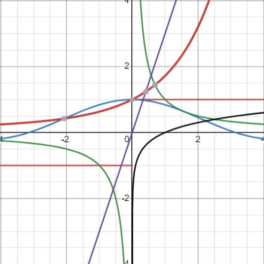
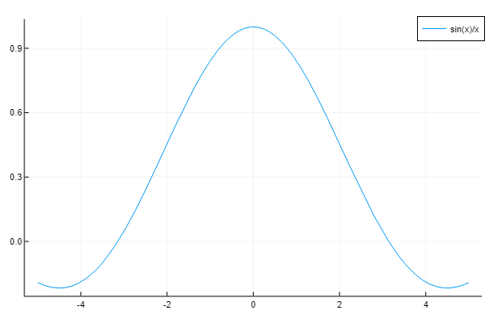

# Continuity-and-Differentiability


<br>
A repository for checking the continuity or differentiability of a mathematical function<br>
Suppose we have a mathematical function in one variable and we'd like to find if it is continuous at a certain point or not. This program does exactly that and tries to find the answer for you.<br>
The background is the simple fact of basic mathematics where we find out the left hand limits and the right hand limits and check if they are equal or not. In short, a function is continuous, if both the left hand and the right hand limits are the same. Mathematically, this can be defined as:<br>
<br>
The function `lim` contains three arguments:
- `f`: The function to check the continuity
- `x=0`:  The point where you'd want to check the continuity of `f` (by default its 0)
- `eps=1.0e-7`: The tolerance (or epsilon as we'd like to call it) of the accepted neighbourhood, inside which we'll call the function is continuous (by default its 1.0e-7)

###  Usage
In most of the cases, the provided `Jupyter Notebook` would be enough for the tasks. Enter the function and the program returns a DataFrame as the output which has:
- `Expression`: The input expression
- `x`:  The point where the function needs to be checked (by default its 0)
- `h`:  The final value of `h` such that<br> 
- `UpperLimit`: The value of the upper limit of the function at `x`
- `LowerLimit`: The value of the lower limit of the function at `x`
- `Summary`:  Either `Discontinuous` or `Continuous` according as the upper and lower limits are same or not
- `Limit`:  If the function is discontinuous, this returns `Undefined` else this returns the limit of the function at `x`
- `Iterations`: Number of iterations taken for attaining convergence, if any (Note that this will stop at 100 if the function is discontinuous)

If anyone wants to dive deep:
- The `dependencies.jl` file needs to be run before the other files (as it contains some libraries which needs to be loaded for the program).
- The file `limit.jl` contains the function `lim` which is the main function in this whole project.
- The `run.jl` program prompts the user for an input function. Thus should be run after the previous two files mentioned.

The program works by taking a suitable value of `h`(=0.1) and then checking if the two limits are almost equal or not (by the tolerance as defined earlier) while dividing `h` by 100 in successive iterations. If it satisfies the check (within 100 iterations), then it returns as "Continuous" (via the `i` variable which is an indicator). However, if after 100 iterations, the check is still not satisfied, the program returns as "Discontinuous", again via the indicator `i`.<br>
Plotting the function is optional, however, it has been provided as an additional visualisation.<br>
Note that only functions of single variable are supported, as of now. Also, manually fabricated functions are not be accepted. Further, tending to infinity is not alowed (yet).

### Example runs

```
1×8 DataFrame
 Row │ Expression  x      h        UpperLimit  LowerLimit  Summary     Limit    Iterations 
     │ String      Int64  Float64  Float64     Float64     String      Float64  Int64      
─────┼─────────────────────────────────────────────────────────────────────────────────────
   1 │ sin(x)/x        0      0.1    0.998334    0.998334  Continuous      1.0           1
```


```
1×8 DataFrame
 Row │ Expression  x      h         UpperLimit  LowerLimit  Summary        Limit      Iterations 
     │ String      Int64  Float64   Float64     Float64     String         String     Int64      
─────┼───────────────────────────────────────────────────────────────────────────────────────────
   1 │ abs(x)/x        0  1.0e-199         1.0        -1.0  Discontinuous  Undefined         100
```


### Future Implementations
Coming soon to this is the differentiabiity checker, multi-variable support and many bug-fixes and improvements. An improved and updated documentation will also be provided.

### Updates in this new version
- You can now plot your function and see the graph for yourself

### Bugs
- Found a weird bug that causes the input to behave differently from expectation while running the `.jl` files

----
The program was implemented in:
```
Julia Version 1.7.2
Commit bf53498635 (2022-02-06 15:21 UTC)
Platform Info:
  OS: Windows (x86_64-w64-mingw32)
  CPU: 11th Gen Intel(R) Core(TM) i5-1135G7 @ 2.40GHz
  WORD_SIZE: 64
  LIBM: libopenlibm
  LLVM: libLLVM-12.0.1 (ORCJIT, tigerlake)
Environment:
  JULIA_EDITOR = code
  JULIA_NUM_THREADS =
```
----
### This repository contains
- **plots**: Contains the plots for the example functions in the documentation
- **dependencies.jl**: Important packages that needs to be loaded before running the program
- **limit.jl**: The main working function for this program
- **run.jl**: User input prompts and implementations for the main working function
- **limit.ipynb**: Jupyter notebook for the whole program (in most of the cases you'd like to run this only without running the other three)
